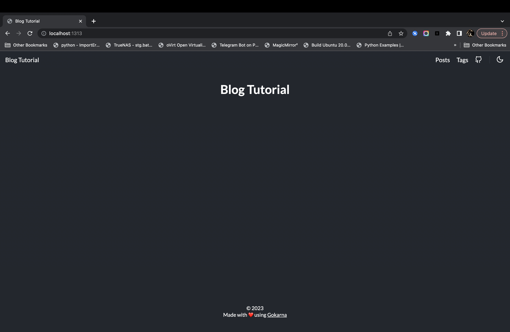

Hai semua, selamat datang di [sengat.org](https://sengat.org). kali ini kita akan belajar membuat personal web dengan Hugo.
Sebelum kita mulai mari kita berkenalan dengan Hugo.

## APA ITU HUGO?


[Hugo](https://gohugo.io) merupakan framework static site generator(SSG) yang ditulis dalam bahasa pemrograman Go. Hugo dikembangkan oleh Bjørn Erik Pedersen, Steve Francia, dan kontributor lainnya.


## MENGINSTALL HUGO

Untuk memulai membuat web dengan Hugo kalian perlu menginstall `git`, `go`, dan `hugo` di laptop atau komputer kalian. Untuk menginstall Hugo bisa menggunakan cara dibawah ini:
Untuk MacOS
- pastikan macbook atau mac mini atau desktop mac kalian sudah terinstall [Homebrew](https://brew.sh/)

jika sudah terinstall silahkan eksekusi perintah berikut:
```bash
brew install hugo
```

Untuk Linux
Untuk OS Linux ada beberapa cara menyesuaikan dengan paket manajer OS kalian masing-masing.
- Ubuntu
```bash
sudo snap install hugo
```
- Debian
```bash
sudo apt install hugo
```
- Fedora
```bash
sudo dnf install hugo
```
- Untuk distro lain kalian bisa melihatnya [disini](https://gohugo.io/installation/linux/)

Untuk Windows
Untuk sistem operasi windows kalian bisa menginstall dari _prebuilt binary_ yang sudah disediakan hugo [disini](https://github.com/gohugoio/hugo/releases/latest). Atau kalian bisa membaca secara detail [disini](https://gohugo.io/installation/windows/). 

Untuk Container/Docker
Selain bisa di install di sistem operasi kalian hugo juga bisa di install secara containerized dengan mengeksekusi perintah berikut:
```docker
docker pull klakegg/hugo
```

## MEMBUAT WEBSITE ATAU PROJECT BARU

Setelah selesai install hugo langkah selanjutnya adalah membuat site baru atau project baru dengan mengkesekusi perintah berikut:
```bash
hugo new site blog
```
jika berhasil akan muncul seperti ini
```yaml
Congratulations! Your new Hugo site is created in /Users/nama/blog.

Just a few more steps and you're ready to go:

1. Download a theme into the same-named folder.
   Choose a theme from https://themes.gohugo.io/ or
   create your own with the "hugo new theme <THEMENAME>" command.
2. Perhaps you want to add some content. You can add single files
   with "hugo new <SECTIONNAME>/<FILENAME>.<FORMAT>".
3. Start the built-in live server via "hugo server".

Visit https://gohugo.io/ for quickstart guide and full documentation.
```

## MENAMBAHKAN TEMA

Setelah selesai membuat site baru kalian bisa menambahkan tema agar website kalian terlihat keren dan rapih.

- Kalian bisa memilih tema [disini](https://themes.gohugo.io/).
- Pada tutorial ini saya memakai tema [Gokarna](https://themes.gohugo.io/themes/gokarna/).
- Lakukan `git init` karena kita akan memakai metode `git submodule` untuk mengunduh temanya.

berikut langkah-langkahnya:
```bash
cd blog
git init
git submodule add https://github.com/526avijitgupta/gokarna.git themes/gokarna
```
jika sudah hapus `config.toml` lalu buat baru `config.toml` dengan isi seperti berikut:
```toml
baseURL = "http://example.org/"
defaultContentLanguage = "en"
languageCode = "en"

title = "My New Hugo Site"

theme = "gokarna"

# Automatically generate robots.txt
enableRobotsTXT = true

[menu]
  [[menu.main]]
    # Unique identifier for a menu item
    identifier = "posts"

    url = "/posts/"
    
    # You can add extra information before the name (HTML format is supported), such as icons
    pre = ""

    # You can add extra information after the name (HTML format is supported), such as icons
    post = ""

    # Display name
    name = "Posts"

    # Weights are used to determine the ordering
    weight = 1

  [[menu.main]]
    identifier = "tags"
    name = "Tags"
    url = "/tags/"
    weight = 2
    
  [[menu.main]]
    identifier = "github"
    url = "https://github.com"
    weight = 3
    
    # We use feather-icons: https://feathericons.com/
    pre = "<span data-feather='github'></span>"
```
seuaikan `baseURL` dengan domain kalian atau kalian bisa isi dengan `/` untuk lebih _universal_ , sesuaikan juga `title` dengan nama website kalian.

## MENJALANKAN WEBSITE DI LOKAL

Setelah semua langkah diatas selesai kalian bisa mencoba menjalankan website kalian di lokal (laptop maupun pc) dengan cara berikut:
```
hugo server
```
lalu buka browser kalian dan isi urlnya dengan `localhost:1313` maka tampilan web kalian sudah jadi seperti ini


Sekian dulu belajar membuat personal web dengan Hugo. Kita akan sambung di _tutorial_ selanjutnya

Thanks!